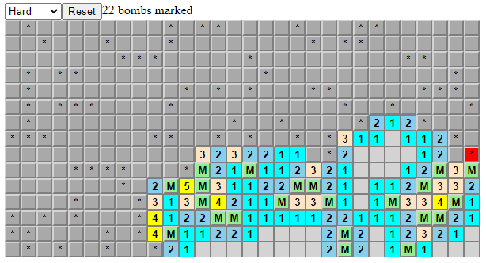

# Andrew's Minesweeper clone

The game has 90% functionality, missing only the timer and pretty pictures.

[Feel free to try it today!](https://Andrew836-dev.github.io/react-sweeper)

## Screenshot

I may update the state to implement useReducer on top of the dispatch functions I did implement.

This project was bootstrapped with [Create React App](https://github.com/facebook/create-react-app).